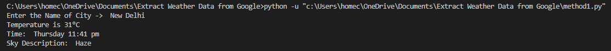
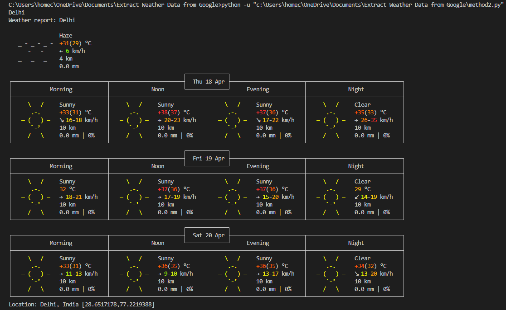

# Weather Data Extraction from Google

This guide demonstrates how to extract weather data from Google using Python. Google doesn't provide its own weather API; instead, it retrieves data from weather.com and displays it when you search on Google. Here, we'll scrape the data from Google and explore an alternative method to fetch a schematic depiction of a location’s weather data for the next two days in Python without utilizing an API.

### Method 1:

#### Dependencies:
- **Requests**: Requests allow you to send HTTP/1.1 requests easily.
- **bs4 (Beautiful Soup)**: A library for scraping information from web pages.

To install the required modules, run the following command in your terminal:

```bash
pip install requests
```


## Approach

1. Import the required modules.
2. Construct the URL with the entered city name.
3. Make a requests instance and pass the URL.
4. Extract the required data from the soup.
5. Print the required data.

## Installation and Usage:
Follow the step-wise implementation provided in the code below:
```python
# importing the library
import requests
from bs4 import BeautifulSoup

# enter city name
city = input("Enter the Name of City ->  ")

# create url
url = "https://www.google.com/search?q=" + "weather" + city

# requests instance
html = requests.get(url).content

# getting raw data
soup = BeautifulSoup(html, 'html.parser')

# get the temperature
temp = soup.find('div', attrs={'class': 'BNeawe iBp4i AP7Wnd'}).text

# this contains time and sky description
str = soup.find('div', attrs={'class': 'BNeawe tAd8D AP7Wnd'}).text

# format the data
data = str.split('\n')
time = data[0]
sky = data[1]

# list having all div tags having particular class name
listdiv = soup.findAll('div', attrs={'class': 'BNeawe s3v9rd AP7Wnd'})

# particular list with required data
strd = listdiv[5].text

# formatting the string
pos = strd.find('Wind')
other_data = strd[pos:]

# printing all the data
print("Temperature is", temp)
print("Time: ", time)
print("Sky Description: ", sky)
print(other_data)

```
### Output



### Method 2:
#### Dependencies:
- **Requests**: For sending HTTP requests.
Install requests using:

```bash
pip install requests
```
## Approach:
1. Import the requests module.
2. Send a request to retrieve IP location information.
3. Extract the city location in JSON format.
4. Pass the city name to retrieve weather data.
5. Print the weather information.

## Installation and Usage:
Follow the provided code implementation:
```python
# Python code to display schematic weather details
import requests

# Sending requests to get the IP Location Information
res = requests.get('https://ipinfo.io/')

# Receiving the response in JSON format
data = res.json()

# Extracting the Location of the City from the response
citydata = data['city']

# Passing the City name to the url
url = 'https://wttr.in/{}'.format(citydata)

# Getting the Weather Data of the City
res = requests.get(url)

# Printing the results
print(citydata)
print(res.text)
```
### Output



## Contact

[](https://www.linkedin.com/in/shubhambhatia2103/) [](https://github.com/shubhambhatia2103) [](https://instagram.com/6eingshubham) [](https://twitter.com/whoodattboyy)


